# MQ-AI

An IoT and video-analytics platform: register sensors and cameras, run YOLO-based detection on camera feeds, raise alerts on detections or sensor thresholds, and ask an LLM chat assistant questions about any of it. Three services (Java device registry, Python camera/video registry, Python AI inference and alerting) sit behind one nginx entrypoint, backed by a single Postgres instance and MQTT/MediaMTX for the device and video data planes.

## How to Use

### Devices

**1. Register a device**

Fill in a name, device code, and product key, then submit. The form shows you the exact MQTT broker address and topic your device's firmware needs to publish to, plus an example JSON payload: copy these before the physical device even exists.

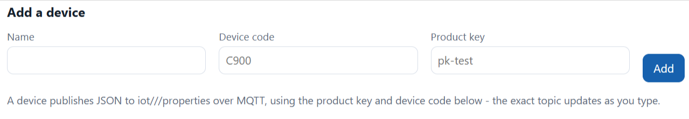

**2. Browse and select a device**

The table at the bottom lists every registered device. Click a row to make it the dashboard's focus device (it highlights). Use the delete button on a row to remove a device (asks for confirmation first).

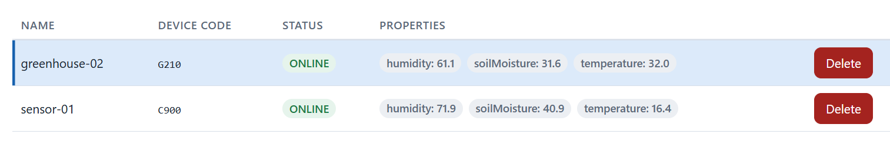

**3. Watch live readings**

The card at the top shows the selected device's status (online/offline) and its current sensor values, updating automatically.

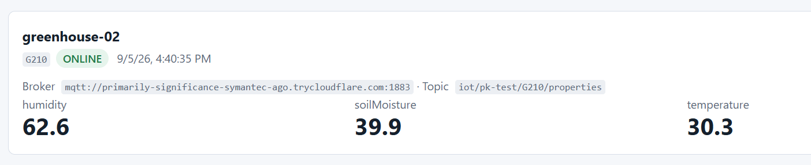

**4. View history and thresholds**

Pick a property and a time window (last hour / last day) to see it plotted over time. Any alert rule watching that property shows up as a dashed threshold line, so you can see how close a reading came to triggering an alert.

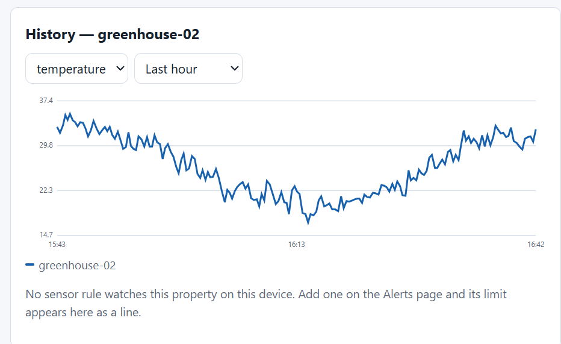

**5. Catch unregistered devices**

If MQTT traffic arrives from a device code / product key nobody registered, it shows up here with a hit count and last-seen time: usually a firmware typo or a device you forgot to add.

### Cameras

**1. Register a camera**

Enter a name and RTSP URL, then submit. The camera is tested immediately. If it can't be reached, it's rejected on the spot rather than saved broken.

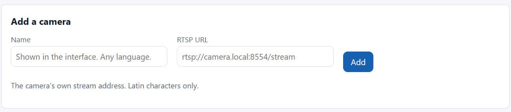

**2. Browse your cameras**

The table lists every camera with its reachability status, resolution, RTSP URL, and last error if any.

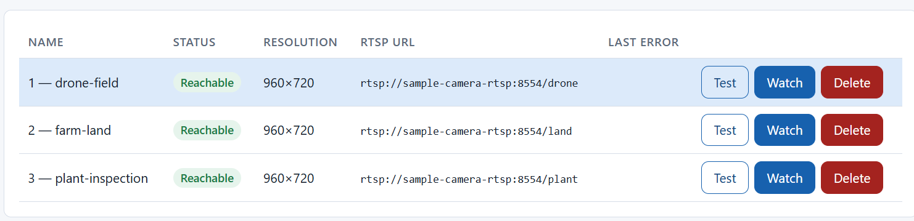

**3. Re-test a camera**

Click **Probe** to re-check a camera without deleting it. This is useful after fixing a network issue or camera reboot. Unlike registration, a failed probe is recorded, not rejected.

**4. Watch a camera live**

Click **Watch** (only enabled once a camera is reachable) to start streaming it in the browser. The stream can take a few seconds to warm up the first time.

> If nothing appears after about 20 seconds, the app detects the stall automatically and retries on its own, up to 2 times. If it still doesn't come through, click **Stop watching** and press **Watch** again to reset the connection from scratch.

**5. Remove a camera**

Delete a camera from the table's action column.

### Detections

**1. Start or stop analysis on a camera**

Pick a model (or a combination) from the dropdown, then click **Start** to begin analysing that camera. Click **Stop** to end it. While running, the row shows frames analysed, detections saved, and any error.

> If you plan to use the chatbot with the local Ollama model, stop detection tasks first. Chat and detection share the same limited CPU, and CPU-based chat replies get slow when detection is also running.

> A camera watching something that never moves, like a parked truck, will keep creating new detections and snapshots every few seconds for as long as it stays in view. This is not fixed by the alert cooldown, since that only limits alerts, not detections. From this page the only control you have is **Stop**; if you don't need that camera watched continuously, stop it rather than let it keep filling storage.

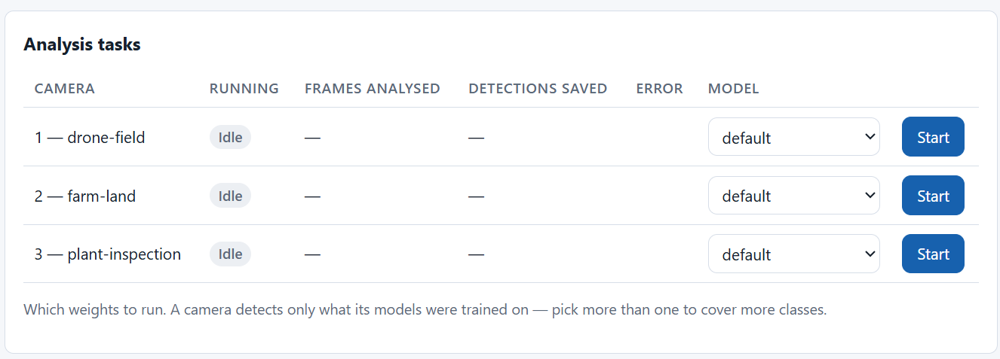

**2. See counts by label**

A table of how many detections of each label came from each camera, over the last day.

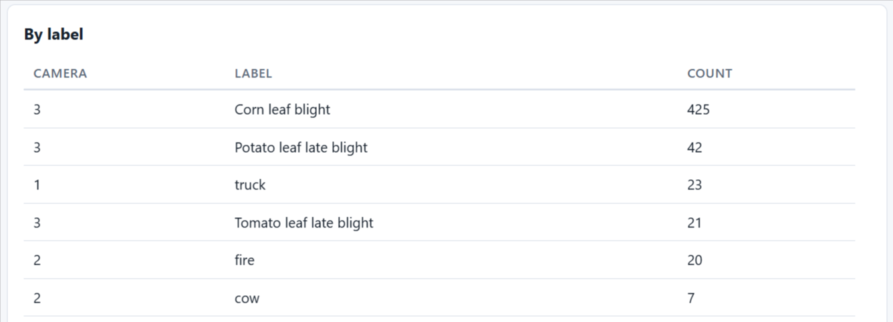

**3. Browse recent frames**

A gallery of the most recent annotated snapshots. Click one to view it full screen.

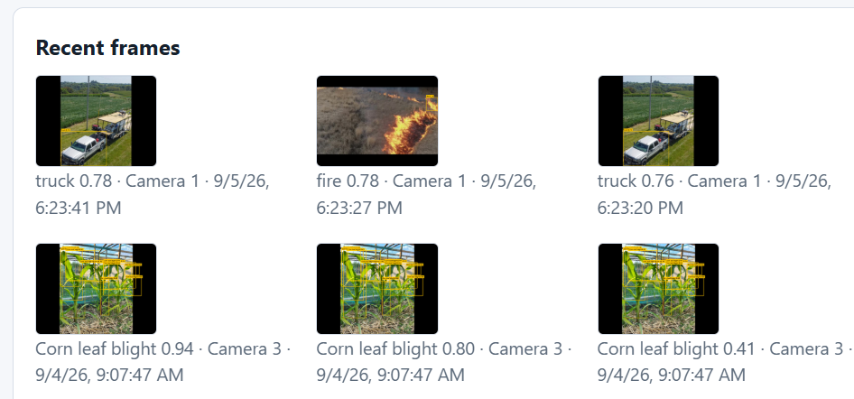

### Alerts

**1. Summary at a glance**

Cards showing how many alerts are open, the total ever raised, and a count per severity.

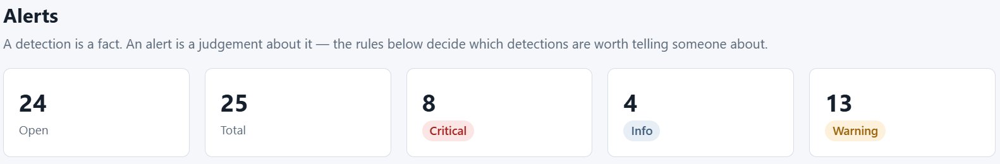

**2. Create a rule**

Choose a kind: detection (a camera plus a label, like "person") or device (a sensor property, operator, and threshold, like "temperature > 35"). Labels and property keys come from real dropdowns built from your actual models and sensor readings, so a typo can't silently create a rule that never fires. Set a cooldown and severity for the rule.

> A detection only becomes an alert if a matching rule exists and is enabled. If no rule covers that camera and label, or the matching rule is disabled, the camera still detects it (visible on the Detections page) but no alert is raised here.

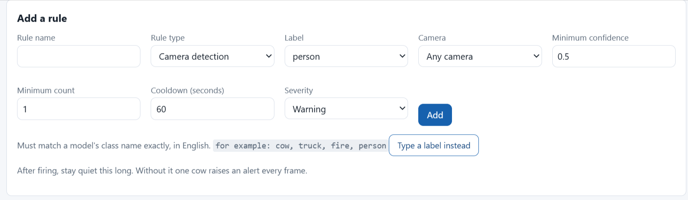

**3. Manage rules**

The rules table lets you disable a rule, re-enable it, or delete it. There's no edit button for other fields (name, threshold, etc). To change those, delete the rule and create a new one with the Add Rule form.

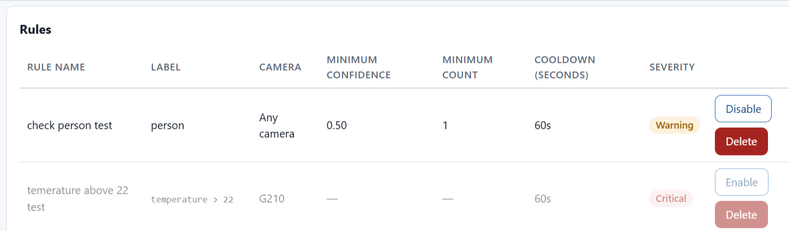

**4. Review alerts**

The alerts table shows what actually fired, with a thumbnail you can click to view full screen. Acknowledge an alert once you've seen it. Checking **Open alerts only** filters the list down to unacknowledged alerts, hiding any you've already acknowledged. Load more if there's history beyond what's shown.

> Alerts are never deleted. Acknowledging one just marks it seen, it stays in the table (and in the total count) indefinitely.

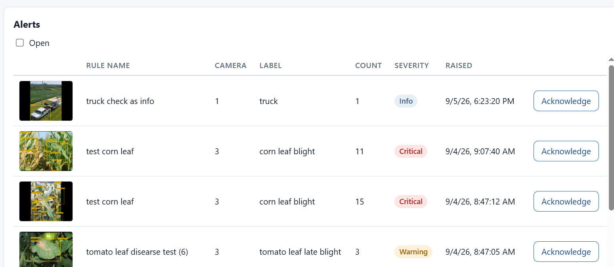

### Ask

**1. Ask a question**

Type a question or click one of the example buttons, then send. The assistant answers using live data from the platform (alerts, devices, cameras, tasks), not guesses.

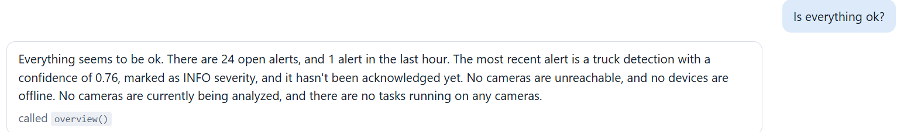

**2. See what it checked**

Each answer shows which tool calls it made to get its data, so you can see where the numbers came from.

> If an answer takes too long or times out, try stopping running detection tasks (see the Detections page) and ask again. Chat and detection (YOLO) share the same CPU, so a busy detection task can slow the chatbot down or make it time out.

## Architecture

One nginx entrypoint in front of three independent services, each owning its own Postgres schema and talking to the others only over HTTP, never touching another's tables directly. One MQTT broker for devices, one media server (MediaMTX) for cameras, and ai-service running both YOLO-based detection and an LLM chat assistant on top of everything else.

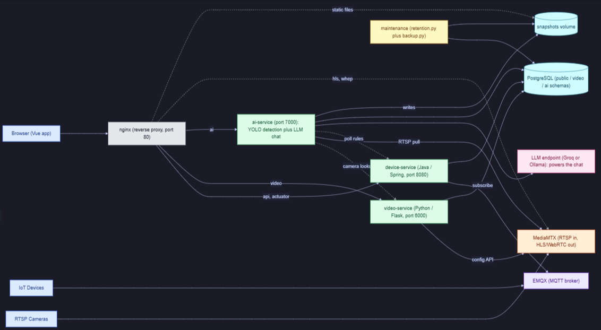

- **Device data**: device to EMQX to device-service to Postgres.
- **Video**: camera to MediaMTX, which serves the live stream straight to the browser (HLS/WebRTC) and separately feeds raw frames to ai-service.
- **Detection**: ai-service pulls frames from MediaMTX and runs them through YOLO and other models (fire, plant disease) to produce detections and annotated snapshots.
- **Alerts**: a detection or a device reading is checked against the rules in ai-service, which raises an Alert if one matches.
- **Chat**: ai-service also runs an LLM-based assistant that answers questions using live platform data, fetched through the same tool calls a human could trigger from the UI.
- The stack also ships with a sample device and a sample camera, so you can try the whole platform right away without connecting real hardware.

## Technical

### device-service

**What it does**

The device registry and MQTT ingestion pipeline: the only service that speaks MQTT.

- Owns device identity: registration, status (ONLINE/OFFLINE), and every sensor reading reported over MQTT
- Surfaces MQTT traffic from unrecognized devices instead of silently dropping it

REST API (`/api/devices`):
- `GET /` list · `POST /` register · `GET /{id}` · `PUT /{id}` · `DELETE /{id}`
- `GET /{deviceId}/properties`: latest value of every key, or one key's history (`?key=...&limit=...`)
- `GET /unregistered`: MQTT traffic from device codes / product keys nobody registered, for spotting firmware misconfiguration

MQTT ingestion (EMQX, topics `iot/{productKey}/{deviceCode}/properties` and `.../status`):
- a property message → one row per key; a status message → flips ONLINE/OFFLINE
- an unrecognized device/productKey pair → tracked in memory, not the database (`productKey`, `deviceCode`, reason, count, first/last seen)
- **no way to delete an unregistered entry**: even after you register the device, its old sighting stays listed, frozen, in the UI
- it only disappears when: the 200-entry cap evicts it (oldest pushed out first), or the service restarts (memory wiped)

**Compose config**

- `build: context: ../device-service`: built from the local Dockerfile, not a prebuilt image
- `restart: always`: restarts automatically if the container dies
- `runtime: runc`: pinned explicitly, so it works regardless of what the host's Docker default-runtime is set to (a shared host might default to `nvidia` for other, GPU-dependent services)
- `depends_on`: `PostgresSQL` and `EMQX`, both gated on `condition: service_healthy`: won't start until both report healthy
- `expose: 8080` only: no host port; reachable externally solely through nginx's `/api/` and `/actuator/` proxy locations
- Env vars: `SPRING_DATASOURCE_URL/USERNAME/PASSWORD` (built from `POSTGRES_*`), `MQTT_BROKER_URL=tcp://EMQX:1883`
- Healthcheck: hits its own `/actuator/health` (15s interval, 5 retries, 60s start period before it's allowed to fail)
- `networks: easyaiot-network`: the shared compose network every service sits on

**Connections**

- **EMQX** (MQTT broker): outbound connection *from* device-service *to* EMQX (client, not server); subscribes to `iot/+/+/properties` and `iot/+/+/status` on connect/reconnect
- **PostgreSQL**: JDBC, schema managed by Flyway (not by the entities: `ddl-auto: validate` only checks they match, never creates/alters)
- **nginx**: the only inbound path; proxies `/api/` and `/actuator/` to it. Nothing reaches device-service directly from outside the compose network: no host port is exposed

**Database**

No dedicated schema: lives in `public` (unlike video-service's `video` schema or ai-service's `ai` schema). Flyway-managed, two migrations:

- **`device`**: `id, name, device_code (unique), product_key, status (ONLINE/OFFLINE, default OFFLINE), created_at`. Indexed on `product_key`.
- **`device_property`**: `id, device_id (FK→device, ON DELETE CASCADE), property_key, property_value (TEXT), recorded_at`. One row per reading: full history, not a latest-only "shadow" table. Indexed on `(device_id, property_key, recorded_at DESC)`, which serves two query shapes: the newest reading per key (via Postgres `DISTINCT ON`) and one key's full history.

**Ops rules that touch it**

- **`retention.py`** (daily cron): deletes `device_property` rows older than `RETENTION_DAYS`. Age-only, no per-device row cap (unlike `ai.detection`'s age+cap combo): the dashboard only ever queries up to 24h back, so anything older has no UI path that could reach it. `device` itself is never pruned: registrations aren't high-volume.
- **`backup.py`**: both tables are ordinary tables in the shared Postgres instance: included whole in the daily `pg_dump`, no special-casing needed.

### video-service

**What it does**

The camera registry and MediaMTX control plane: owns which RTSP cameras exist, never touches actual video.

- CRUD for cameras: register (name + RTSP URL, optional probe-only validate), list, get, delete
- Every registration is **verified before saving**: `ffprobe` connects briefly, reads codec/resolution/fps, and a camera that can't be reached is rejected outright, never stored broken
- Keeps MediaMTX's path mapping in sync: on register/delete it tells MediaMTX (over HTTP config API) which RTSP URL belongs to which camera; on its own startup it replays every camera in Postgres back into MediaMTX, since MediaMTX only holds that mapping in RAM and forgets it on restart
- Never proxies or touches video bytes: actual streaming is MediaMTX pulling RTSP on-demand (only while a viewer is watching) and serving HLS/WebRTC directly to the browser through nginx

REST API (`/video/camera`):
- `POST /` register (rejects if unreachable) · `GET /` list · `GET /{id}` · `DELETE /{id}`
- `POST /{id}/probe`: re-test an existing camera, unlike registration this **stores** the failure instead of rejecting
- `GET/POST/DELETE /{id}/stream`: query/register/unregister the camera's mapping in MediaMTX (config only, no RTSP made here)

**Compose config**

- `build: context: ../video-service`: built from the local Dockerfile, not a prebuilt image
- `restart: always`, `runtime: runc`: same reasoning as device-service (auto-restart, pinned runtime so a host's `nvidia` default doesn't hijack it)
- `depends_on`: **PostgreSQL only** (`condition: service_healthy`): notably not MediaMTX, even though it calls it at startup. That's consistent with `resync_streams()`'s own retry logic (3 retries) picking up the slack instead of a hard compose-level dependency
- `expose: 6000` only: no host port, reachable solely through nginx
- Env vars: `DATABASE_URL`, `MEDIA_SERVER_API=http://mediamtx:9997`
- Healthcheck: hits its own `/video/health` (15s interval, 5 retries, 30s start period: half of device-service's 60s)
- `networks: easyaiot-network`

**Connections**

- **PostgreSQL**: SQLAlchemy, `video` schema (separate from device-service's `public`, deliberately: one service per schema, no cross-service table writes). No Flyway here: schema created via `db.create_all()` at startup, guarded by a Postgres advisory lock so multiple workers don't race each other creating it
- **MediaMTX**: outbound HTTP calls *from* video-service *to* MediaMTX's control API (`register_path`/`unregister_path`/`path_info`), config only. video-service never makes an RTSP connection or touches video bytes
- **nginx**: the only inbound path *into* video-service (proxies `/video/`); separately, nginx also proxies straight *to* MediaMTX for the actual HLS/WebRTC playback: that traffic never passes through video-service at all
- **Cameras (RTSP)**: no persistent connection from video-service; the one place it *does* connect is `ffprobe`, a short-lived, spawn-per-call subprocess used only to validate a camera at registration/reprobe time

**Database**

Own schema, `video` (not `public`: deliberately, so device-service's Flyway-managed tables and this stay isolated). No Flyway/Alembic yet: tables are created by `db.create_all()` at startup behind a Postgres advisory lock (`run.py`'s own docstring flags this explicitly as "NOT a substitute for migrations": a future-cleanup admission, not an oversight).

One table:

- **`camera`**: `id, name, rtsp_url, status (UNKNOWN/REACHABLE/UNREACHABLE), codec, width, height, fps, last_error, last_probed_at, created_at`
- `rtsp_url` uniqueness is enforced only in application code (`register_camera`'s `filter_by(...).first()` check before insert), **not** a DB constraint: unlike device-service's `device_code`, which has a real unique index from its Flyway migration. Under concurrent requests this app-level check has a theoretical race; a DB-level constraint would close it
- No dedicated index beyond the implicit primary key: table stays small (one row per camera, not per reading), so no query pattern needs one yet

**Ops rules that touch it**

- **`retention.py`**: doesn't touch `video.camera` directly: it's a registry table (one row per camera, not a time-series), so there's nothing to age out. It does reference `camera_id` indirectly, in `ai.detection`'s per-camera retention cap (`MAX_DETECTIONS_PER_CAMERA`), but that logic and that table both belong to ai-service, not here
- **`backup.py`**: whole-instance `pg_dump`, no schema-specific handling: `video.camera` gets backed up automatically along with every other schema, same as device-service's tables

### ai-service

**What it does**

Runs live multi-model inference per camera and turns detections into alerts.

- One `InferenceWorker` thread per camera, managed by a registry with start/stop/status/reap. Start is idempotent, and dead threads get reaped so a restart can recreate them.
- Each frame runs through every model configured for that camera, not just one. A transformers based plant disease model and an Ultralytics fire model can both fire on the same frame; results are merged into one shape.
- Each model applies its own confidence floor instead of one global threshold, since a single global value either missed real detections or let noisy ones through depending on the model.
- Frames are dropped, not queued: the loop always analyses the newest frame available when it wakes, never backlog. Live monitoring cares about what the camera sees now, not every frame in order.
- Detections are saved, annotated onto one shared snapshot image so results from different libraries land on the same picture, then passed to the alert rule engine.
- Alert rules come in two kinds: detection (camera plus label, e.g. "person") and device (property, operator, threshold, e.g. "temperature > 35"). Both are validated and normalized through one shared `validate()` that raises actionable, per field errors.
- Turning detections into alerts is mostly deduplication, not detection: a threshold filter (confidence), a quorum filter (min count in one frame), then a cooldown filter, in that order.
- Alerts are rate limited per (rule, scope), where scope is a camera or device. This way one rule alerting on multiple sources isn't silenced by the first one to fire. Cooldown state is cached in memory and only falls back to the database on a cold start, so a restart doesn't re-announce every currently active alert.
- Rule evaluation runs inline on the inference thread but is sandboxed. An exception there costs alerts, it never crashes the inference loop.

**REST API** (`/ai`)

Tasks, one per camera:
- `GET /tasks`: list running tasks (reaps dead workers first)
- `POST /tasks/{cameraId}`: start analysis. Looks the camera up in video-service (404 if not found), builds the MediaMTX RTSP URL, accepts `model`/`interval`/`jitter` as query params or JSON body. Returns 202
- `DELETE /tasks/{cameraId}`: stop, 204
- `GET /tasks/{cameraId}`: status. Not found returns `{cameraId, running: false}` with 200, not a 404

Models:
- `GET /models`: available model names, whether each is currently loaded, and loaded ones' classes. Never loads a model itself, since the UI polls this
- `GET /labels`: every class every configured model can detect, for the rule form's label dropdown. Does load weights, so it's called once per form open, not polled

Detections:
- `GET /detections`: filter by `cameraId`/`label`, `limit` capped at 500
- `GET /detections/summary`: count per (camera, label)

Rules, full CRUD (config a human writes):
- `GET /rules` · `POST /rules` · `GET /rules/{id}` · `PUT /rules/{id}` (partial update) · `DELETE /rules/{id}`
- Update and delete both call `rule_engine.forget(rule_id)` to drop the cooldown cache entry, so an edited or deleted rule can't fire on stale timing
- Deleting a rule doesn't delete its past alerts: the FK is `ON DELETE SET NULL` and each alert keeps a copy of the rule name

Alerts, read and acknowledge only (history the engine writes, never a human):
- `GET /alerts`: filter by `cameraId`, `severity`, `acknowledged`
- `POST /alerts/{id}/ack`: idempotent
- `GET /alerts/summary`: counts by severity, total, unacknowledged
- Deliberately no `POST /alerts`: a hand-invented alert wouldn't mean anything

Chat, an LLM agent loop over a fixed toolset:
- `POST /chat`: up to 4 tool-calling rounds, last 12 history messages kept
- `GET /chat/health`: separate from the service's own `/ai/health` so an LLM outage doesn't mark inference unhealthy too
- `GET /chat/tools`: lists what the model is allowed to call

`GET /ai/health`: overall service health

**Compose config**

- `build: context: ../ai-service`: built from the local Dockerfile, not a prebuilt image
- `restart: always`, `runtime: runc`: same reasoning as the other services (auto-restart, pinned runtime so a host's `nvidia` default doesn't hijack it)
- `depends_on`: **PostgreSQL only** (`condition: service_healthy`): not video-service, even though it calls it per-request; a task simply 404s if video-service or the camera isn't reachable yet
- `expose: 7000` only: no host port, reachable solely through nginx
- `cpus: 4.0` (of 8): a hard ceiling on top of `TORCH_THREADS=2`/`OMP_NUM_THREADS=2`, so inference can never starve the media server or healthchecks. Raised from 2 once the Docker Desktop Kubernetes control plane was turned off freed up headroom
- Env vars: `DATABASE_URL`, `VIDEO_SERVICE_URL`, `MEDIA_RTSP_BASE`, `SNAPSHOT_DIR`, `SAMPLE_INTERVAL_SECONDS`, `MIN_CONFIDENCE=0.65` (measured against real detection/false-positive score clusters, not guessed), `YOLO_EXTRA_MODELS`/`HF_MODELS` (named weight sets beyond the COCO default, e.g. `fire`, `plant`), `MODEL_CONFIDENCE` (per-model confidence floor overrides), `AUTOSTART_TASKS` (which camera/model tasks to start automatically, since tasks live only in memory and don't survive a restart)
- Chat/LLM env vars are provider-agnostic: `LLM_BASE_URL`/`LLM_MODEL`/`LLM_API_KEY` default to a hosted Groq endpoint, swappable to a local Ollama service (present in the compose file but `restart: "no"`, opt-in only) with no code change
- Volumes: `snapshots:/snapshots` (shared with nginx, read-only there) and `../models:/models:ro`: third-party weights mounted rather than baked into the image, so swapping them needs no rebuild
- Healthcheck: hits its own `/ai/health` (15s interval, 5 retries, 60s start period)
- `networks: easyaiot-network`

**Connections**

- **video-service**: outbound HTTP, ai-service calls `GET /video/camera/{id}` to look up a camera before starting a task (404 propagated up if not found or video-service is unreachable). ai-service holds no camera table of its own
- **MediaMTX (RTSP)**: unlike video-service, ai-service does pull actual video bytes here: each `InferenceWorker` opens a direct RTSP connection (via OpenCV/ffmpeg, transport forced to TCP) straight to MediaMTX to grab frames. This is the one service in the stack that touches raw video
- **PostgreSQL**: own `ai` schema (detections, alert rules, alerts), separate from device-service's `public` and video-service's `video`
- **device-service**: outbound HTTP, polled every 15s for device-kind alert rules (`GET /api/devices`, `GET /api/devices/{id}/properties`). Deliberately polling rather than subscribing to MQTT or writing straight into device-service's tables, so the two services stay decoupled at the database
- **LLM endpoint** (Groq, Ollama, or any OpenAI-compatible API): outbound HTTP for chat completions, provider swappable via `LLM_BASE_URL`/`LLM_MODEL`/`LLM_API_KEY` alone, no code change
- **nginx**: the only inbound path into `/ai/` (proxy timeout extended to 320s, kept above the LLM's own 120s timeout so ai-service's own clean error fires first instead of a bare nginx 504). Annotated snapshot images are **not** proxied through ai-service though: nginx serves them straight from the shared `snapshots` volume, the same video-bytes split video-service uses

**Database**

Own schema, `ai` (not `public` or `video`, deliberately: one service owns a table, everyone else asks that service). Created the same way as video-service: `CREATE SCHEMA IF NOT EXISTS` + `db.create_all()` at startup, behind a Postgres advisory lock so concurrent workers don't race. No Flyway/Alembic here either.

Three tables:

- **`detection`**: a fact, not a judgement: `id, camera_id (plain int, no FK: camera belongs to video-service), label, confidence, x1/y1/x2/y2 (box), snapshot, detected_at`. Indexed on `camera_id` and `detected_at`
- **`alert_rule`**: one row per configured condition, shared by both kinds instead of two separate tables, since cooldown/severity/acknowledgement are identical either way and only the condition differs: `id, name, kind (detection|device), camera_id (NULL = any camera), label, min_confidence, min_count, device_code (NULL = any device), property_key, operator, threshold, cooldown_seconds, severity, enabled, created_at`
- **`alert`**: a judgement: what a rule actually raised. `id, rule_id (FK → alert_rule, ON DELETE SET NULL), rule_name (snapshotted, survives rule deletion), camera_id, device_code (exactly one of these two populated), label, count, max_confidence (doubles as the raw reading for a device alert: same column, different meaning, so there's one table and one list view instead of two), severity, snapshot, raised_at, acknowledged, acknowledged_at`

**Ops rules that touch it**

- **`retention.py`** (daily cron): deletes old `ai.detection` rows two ways. Older than `RETENTION_DAYS`, or past the newest `MAX_DETECTIONS_PER_CAMERA` for that camera, whichever hits first. The age rule alone misses a camera that stays busy nonstop, so the per-camera cap catches that
- It also deletes the matching snapshot file on disk, but only after checking `ai.alert` doesn't still use that same filename
- `ai.alert` itself is never deleted by retention. Alerts are kept forever at this stage, since they're the curated output a human should see, not raw data
- **`backup.py`**: backs up both the database (`pg_dump`, `ai` schema included like everything else) and the snapshot images separately, since `pg_dump` doesn't know `/snapshots` exists. Same daily/weekly/monthly rotation as the other services, kept independent from retention.py on purpose

## Limitations

- **ai-service does three jobs at once**: inference, both kinds of alert rules, and the chat agent, all in one Flask process. Splitting it (inference / alerting / chat) would let each scale and fail independently, at the cost of needing a shared way to reach the `ai` schema or rule state across services.
- **CPU-only, single host, tightly rationed**: no GPU anywhere in the stack. `TORCH_THREADS=2`, a 4-of-8 CPU cap on ai-service, and a 2-core cap on Ollama are all explicit in the compose file. The code itself documents that chat and YOLO inference compete for the same cores.
- **Services call each other synchronously over HTTP instead of an event bus**: ai-service blocks on video-service to look up a camera, and polls device-service every 15s for device rules instead of reacting to readings as they arrive. This was a deliberate simplicity choice (documented in `device_monitor.py`), but it does mean added latency and a hard dependency on the other service being up right now, something Kafka or another broker would remove.
- **Local LLM quality is capped by host RAM**: 8GB isn't enough to run a strong model locally alongside the rest of the stack, so decent chat quality means depending on a hosted API (Groq), with its own rate limits (8k tokens/minute on the free tier).
- **No auth between internal services**: nginx enforces basic auth from the outside, but ai-service, video-service, and device-service accept requests from each other, or anyone on the compose network, with no credentials at all.
- **Two of three schemas have no real migrations**: `video` and `ai` are created with `db.create_all()`, not Flyway/Alembic. The code's own docstring in `run.py` flags this as "not a substitute for migrations."
- **Backups aren't off-site**: `backup.py` writes to a local `/backups` volume on the same host as the live database. A full disk or host failure takes out the data and its backup together.
- **Task and cooldown state live in memory, per instance**: running more than one ai-service replica would fragment both the task registry and the alert cooldown cache, so it cannot be horizontally scaled as it stands.
- **No cap on concurrent detection tasks**: nothing stops starting analysis on every camera at once; the CPU ceiling is shared and fixed, so doing that just slows every running task down rather than rejecting the request.
