# MQ-AI

物联网与视频分析平台：注册传感器和摄像头，对摄像头画面运行基于 YOLO 的检测，根据检测结果或传感器阈值发出告警，并可以向 LLM 聊天助手询问以上任何信息。三个服务（Java 设备注册中心、Python 摄像头/视频注册中心、Python AI 推理与告警服务）位于同一个 nginx 入口之后，由单个 Postgres 实例，以及负责设备与视频数据通路的 MQTT/MediaMTX 提供支撑。

## 使用指南

### 设备

**1. 注册设备**

填写名称、设备编码和产品密钥，然后提交。表单会显示设备固件需要发布到的确切 MQTT broker 地址和主题，以及一个示例 JSON 报文：在实体设备真正存在之前就可以先复制这些信息。

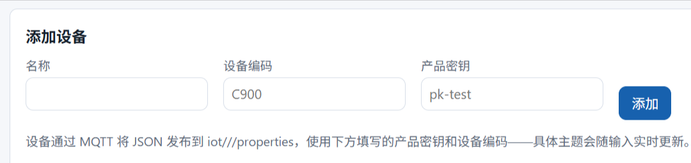

**2. 浏览并选择设备**

底部的表格列出所有已注册设备。点击某一行可将其设为仪表盘的关注设备（该行会高亮）。使用行内的删除按钮可移除设备（会先要求确认）。

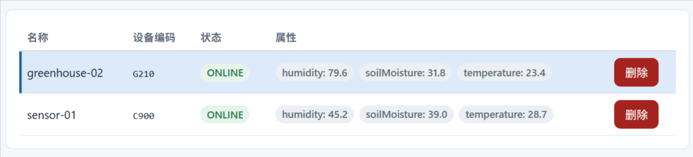

**3. 查看实时读数**

顶部卡片显示所选设备的状态（在线/离线）以及当前传感器数值，并会自动更新。

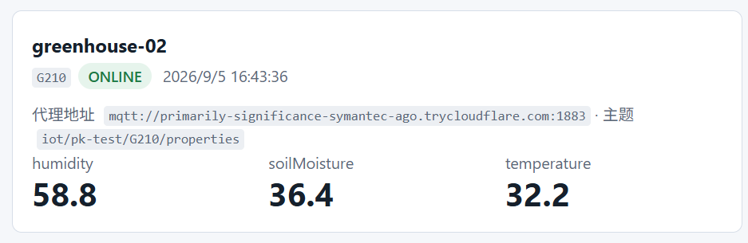

**4. 查看历史记录和阈值**

选择一个属性和时间窗口（最近一小时/最近一天），即可查看其随时间变化的曲线。任何监控该属性的告警规则都会以虚线阈值的形式显示出来，方便你看出某个读数距离触发告警有多近。

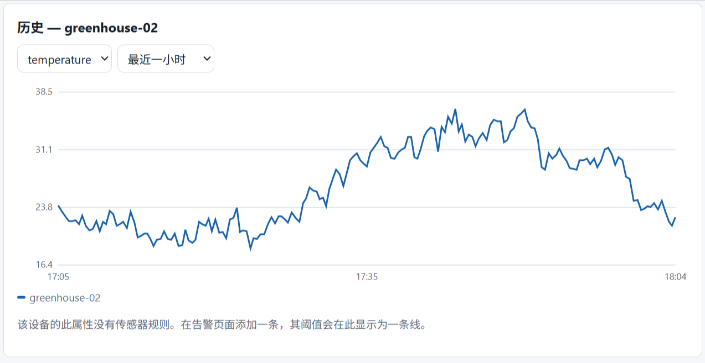

**5. 发现未注册设备**

如果有 MQTT 流量来自尚未注册的设备编码/产品密钥组合，会在此处显示出来，附带命中次数和最后出现时间，通常意味着固件里的拼写错误，或是你忘了添加的设备。

### 摄像头

**1. 注册摄像头**

输入名称和 RTSP 地址后提交。系统会立即测试该摄像头，如果无法连接，会当场拒绝，而不会把一个连不上的摄像头存下来。

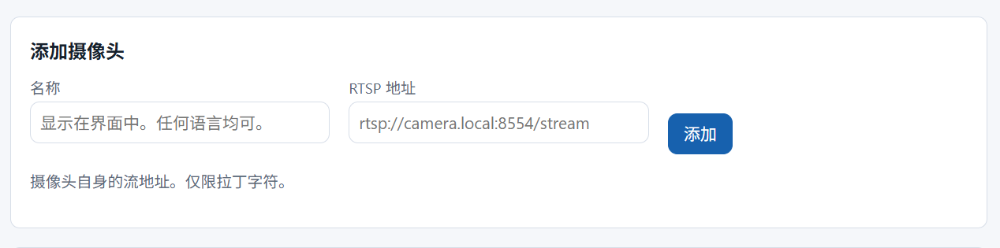

**2. 浏览摄像头列表**

表格列出每个摄像头的可达状态、分辨率、RTSP 地址，以及最近一次错误信息（如果有）。

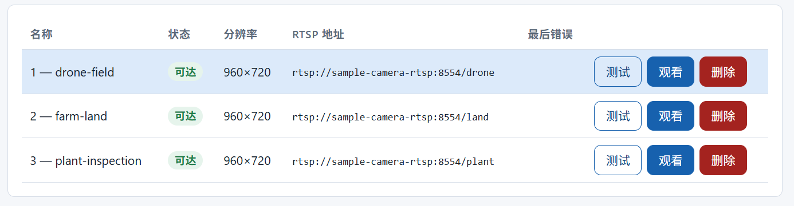

**3. 重新探测摄像头**

点击**探测**可以在不删除摄像头的情况下重新检测它，适合在修复网络问题或摄像头重启之后使用。与注册不同，探测失败只会被记录下来，不会被拒绝。

**4. 实时观看摄像头**

点击**观看**（仅在摄像头可达时可用）即可在浏览器中开始播放该摄像头画面。首次播放可能需要几秒钟预热。

> 如果大约 20 秒后仍未出现画面，应用会自动检测到卡顿并自行重试，最多重试 2 次。如果仍然无法播放，点击**停止观看**再重新点击**观看**，即可从头重新建立连接。

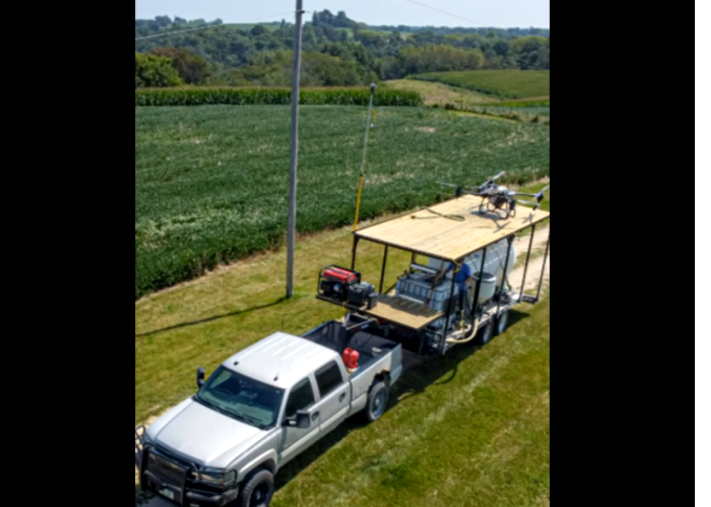

**5. 移除摄像头**

在表格的操作列中删除摄像头。

### 检测

**1. 启动或停止某个摄像头的分析任务**

从下拉框中选择一个模型（或组合模型），点击**开始**即可对该摄像头启动分析，点击**停止**即可结束。运行期间该行会显示已分析帧数、已保存检测数以及错误信息。

> 如果你打算使用本地 Ollama 模型的聊天功能，请先停止检测任务。聊天和检测共用同一份有限的 CPU，检测任务运行时基于 CPU 的聊天回复会变慢。

> 如果摄像头一直盯着一个不会动的东西（比如停着的卡车），它会在整个可见期间每隔几秒就产生新的检测记录和快照。这个问题不能通过告警冷却时间解决，因为冷却时间只限制告警，不限制检测本身。在这个页面里你唯一能做的就是**停止**任务；如果不需要持续监控该摄像头，就应该停止它，而不是任由它不断占用存储空间。

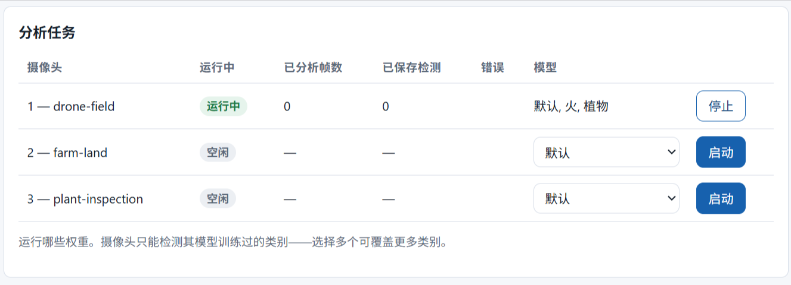

**2. 按标签查看统计**

一张表格，显示每个摄像头各标签的检测次数，统计范围为最近一天。

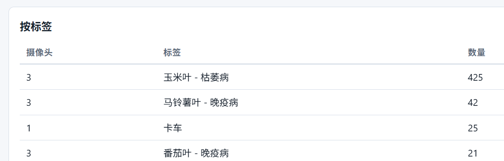

**3. 浏览最近的画面**

最近标注快照的画廊视图。点击任意一张即可全屏查看。

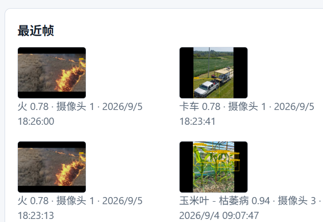

### 告警

**1. 一目了然的摘要**

卡片显示当前未处理的告警数量、历史累计总数，以及按严重级别分类的数量。

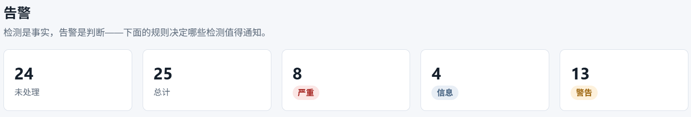

**2. 创建规则**

选择一种类型：检测型（摄像头加标签，例如"person"）或设备型（传感器属性、比较符和阈值，例如"temperature > 35"）。标签和属性键都来自根据你实际模型和传感器读数生成的真实下拉列表，避免拼写错误悄悄创建一条永远不会触发的规则。为规则设置冷却时间和严重级别。

> 只有在存在匹配的、且已启用的规则时，一次检测才会变成一条告警。如果没有规则覆盖该摄像头和标签，或匹配的规则被禁用，摄像头仍然会检测到（可在"检测"页面看到），但这里不会产生告警。

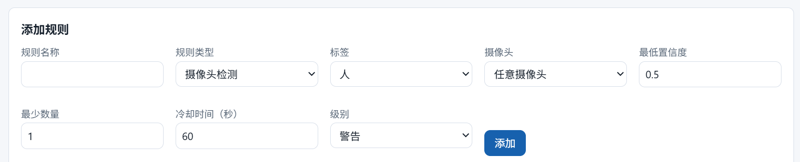

**3. 管理规则**

规则表格支持禁用规则、重新启用，或删除规则。没有编辑其他字段（名称、阈值等）的按钮：要修改这些内容，需要删除该规则并通过"添加规则"表单重新创建一条。

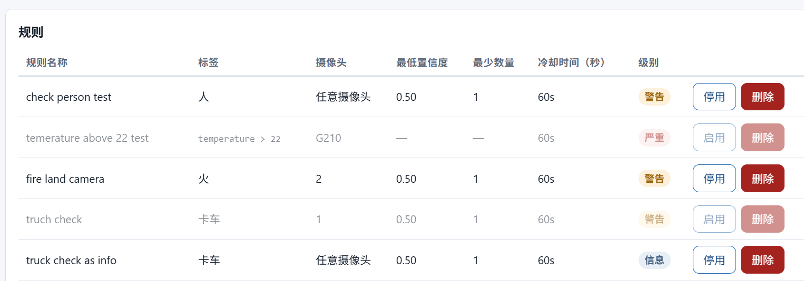

**4. 查看告警**

告警表格显示实际触发的告警，附带可点击全屏查看的缩略图。查看后可以确认（acknowledge）一条告警。勾选**仅显示未处理**会把列表过滤为仅显示未确认的告警，隐藏已经确认过的。如果还有更多历史记录，可以点击加载更多。

> 告警永远不会被删除。确认一条告警只是将其标记为已查看，它会一直留在表格里（并计入总数）。

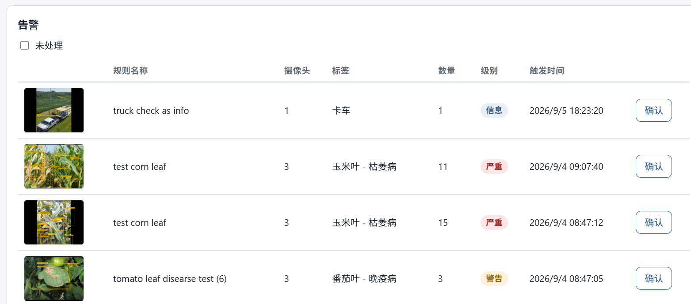

### 问答助手

**1. 提问**

输入问题，或点击某个示例按钮，然后发送。助手会使用平台的实时数据（告警、设备、摄像头、任务）来回答，而不是凭空猜测。

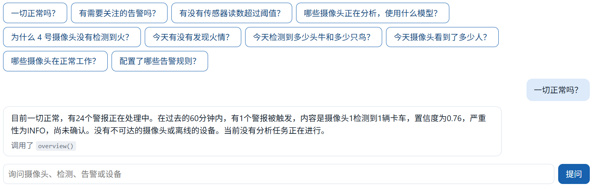

**2. 查看它做了什么查询**

每条回答下方都会显示它调用了哪些工具来获取数据，方便你看清这些数字是从哪里来的。

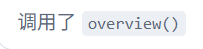

> 如果回答耗时过长或超时，可以尝试先停止正在运行的检测任务（参见"检测"页面），再重新提问。聊天和检测（YOLO）共用同一份 CPU，检测任务繁忙时可能会拖慢聊天助手，甚至导致超时。

## 架构

一个 nginx 入口位于三个独立服务之前，每个服务拥有自己的 Postgres schema，彼此之间只通过 HTTP 通信，从不直接访问对方的数据表。设备使用一个 MQTT broker，摄像头使用一个媒体服务器（MediaMTX），ai-service 则同时负责基于 YOLO 的检测和 LLM 聊天助手。

- **设备数据**：设备 → EMQX → device-service → Postgres。
- **视频**：摄像头 → MediaMTX，画面一分为二，一路直接推送到浏览器供实时观看（HLS/WebRTC），另一路把原始帧交给 ai-service。
- **检测**：ai-service 从 MediaMTX 拉取帧，送入 YOLO 及其他模型（火焰、植物病害）进行推理，生成检测记录和标注快照。
- **告警**：一次检测或一条设备读数会与 ai-service 中的规则进行比对，命中则产生一条告警。
- **聊天**：ai-service 还运行一个基于 LLM 的助手，通过与 UI 上人工触发的相同工具调用来获取实时平台数据，从而回答问题。
- 整套系统还内置了一个示例设备和一个示例摄像头，无需接入真实硬件即可立即体验整个平台。

## 技术细节

### device-service

**功能说明**

设备注册中心和 MQTT 接入管道，是整个系统中唯一使用 MQTT 的服务。

- 拥有设备身份数据：注册信息、状态（ONLINE/OFFLINE），以及通过 MQTT 上报的每一条传感器读数
- 会展示来自未识别设备的 MQTT 流量，而不是默默丢弃它们

REST API（`/api/devices`）：
- `GET /` 列表 · `POST /` 注册 · `GET /{id}` · `PUT /{id}` · `DELETE /{id}`
- `GET /{deviceId}/properties`：返回每个属性键的最新值，或某个键的历史记录（`?key=...&limit=...`）
- `GET /unregistered`：来自未注册设备编码/产品密钥的 MQTT 流量，用于发现固件配置错误

MQTT 接入（EMQX，主题 `iot/{productKey}/{deviceCode}/properties` 和 `.../status`）：
- 一条属性消息 → 每个键一行记录；一条状态消息 → 切换 ONLINE/OFFLINE
- 一个未识别的设备/产品密钥组合 → 记录在内存中，不写入数据库（包含 `productKey`、`deviceCode`、原因、次数、首次/最后出现时间）
- **没有删除未注册记录的入口**：即便之后注册了该设备，它旧的记录仍会冻结显示在界面上
- 只有在以下情况才会消失：200 条上限淘汰它（最旧的先被挤出），或服务重启（内存被清空）

**Compose 配置**

- `build: context: ../device-service`：从本地 Dockerfile 构建，而非预构建镜像
- `restart: always`：容器退出后自动重启
- `runtime: runc`：显式指定，因此无论宿主机 Docker 默认运行时设置为什么都能正常工作（共享主机上其他依赖 GPU 的服务可能默认使用 `nvidia`）
- `depends_on`：`PostgresSQL` 和 `EMQX`，均以 `condition: service_healthy` 为门槛，两者都健康后才会启动
- 仅 `expose: 8080`：不映射宿主机端口，只能通过 nginx 的 `/api/` 和 `/actuator/` 代理路径从外部访问
- 环境变量：`SPRING_DATASOURCE_URL/USERNAME/PASSWORD`（由 `POSTGRES_*` 拼接而成）、`MQTT_BROKER_URL=tcp://EMQX:1883`
- 健康检查：访问自身的 `/actuator/health`（15 秒间隔，5 次重试，60 秒启动期后才允许失败）
- `networks: easyaiot-network`：所有服务共用的 compose 网络

**服务连接**

- **EMQX**（MQTT broker）：由 device-service *主动发起*连接到 EMQX（作为客户端而非服务端）；连接/重连时订阅 `iot/+/+/properties` 和 `iot/+/+/status`
- **PostgreSQL**：JDBC，schema 由 Flyway 管理（而非由实体类管理：`ddl-auto: validate` 只会校验是否匹配，从不创建或修改）
- **nginx**：唯一的入站路径；将 `/api/` 和 `/actuator/` 代理到它。除此之外没有任何请求能从 compose 网络外部直接到达 device-service：没有映射任何宿主机端口

**数据库**

没有独立 schema：位于 `public`（与 video-service 的 `video` schema 或 ai-service 的 `ai` schema 不同）。由 Flyway 管理，包含两个迁移：

- **`device`**：`id, name, device_code (unique), product_key, status (ONLINE/OFFLINE, default OFFLINE), created_at`。在 `product_key` 上建有索引。
- **`device_property`**：`id, device_id (FK→device, ON DELETE CASCADE), property_key, property_value (TEXT), recorded_at`。每条读数一行：完整历史记录，而非只保留最新值的"影子表"。在 `(device_id, property_key, recorded_at DESC)` 上建有索引，可同时服务两种查询：每个键的最新读数（通过 Postgres 的 `DISTINCT ON`）以及某个键的完整历史。

**相关运维规则**

- **`retention.py`**（每日定时任务）：删除超过 `RETENTION_DAYS` 的 `device_property` 记录。只按时间清理，没有按设备的行数上限（不同于 `ai.detection` 的"时间+数量"双重机制）：仪表盘查询范围最多回溯 24 小时，因此更早的数据没有任何界面路径能访问到。`device` 本身从不清理：注册记录量并不大。
- **`backup.py`**：这两张表都是共享 Postgres 实例中的普通表：随每日 `pg_dump` 整体备份，无需任何特殊处理。

### video-service

**功能说明**

摄像头注册中心和 MediaMTX 控制平面：只负责哪些 RTSP 摄像头存在，从不接触实际视频数据。

- 摄像头的增删改查：注册（名称 + RTSP 地址，可选仅探测校验）、列表、获取、删除
- 每次注册都会**先验证再保存**：`ffprobe` 简短连接，读取编码格式/分辨率/帧率，无法连接的摄像头会被直接拒绝，绝不会把一个连不通的摄像头存下来
- 保持与 MediaMTX 路径映射的同步：注册/删除时通过 HTTP 配置接口告知 MediaMTX 哪个 RTSP 地址对应哪个摄像头；自身启动时会把 Postgres 里所有摄像头重新回放注入 MediaMTX，因为 MediaMTX 只把这份映射保存在内存中，重启就会丢失
- 从不代理或接触视频字节：真正的流媒体传输是由 MediaMTX 按需拉取 RTSP（仅在有观众观看时）并通过 nginx 直接向浏览器提供 HLS/WebRTC

REST API（`/video/camera`）：
- `POST /` 注册（不可达则拒绝） · `GET /` 列表 · `GET /{id}` · `DELETE /{id}`
- `POST /{id}/probe`：重新探测已有摄像头，与注册不同的是，这里会**记录**失败结果而不是拒绝
- `GET/POST/DELETE /{id}/stream`：查询/注册/取消该摄像头在 MediaMTX 中的映射（仅配置操作，不在此处建立 RTSP 连接）

**Compose 配置**

- `build: context: ../video-service`：从本地 Dockerfile 构建，而非预构建镜像
- `restart: always`、`runtime: runc`：与 device-service 原因相同（自动重启，固定运行时以免宿主机的 `nvidia` 默认值影响它）
- `depends_on`：**仅 PostgreSQL**（`condition: service_healthy`）：明显不包括 MediaMTX，尽管启动时会调用它。这与 `resync_streams()` 自带的重试逻辑（3 次重试）相呼应，而不是靠 compose 层面的硬依赖
- 仅 `expose: 6000`：不映射宿主机端口，只能通过 nginx 访问
- 环境变量：`DATABASE_URL`、`MEDIA_SERVER_API=http://mediamtx:9997`
- 健康检查：访问自身的 `/video/health`（15 秒间隔，5 次重试，30 秒启动期：是 device-service 60 秒的一半）
- `networks: easyaiot-network`

**服务连接**

- **PostgreSQL**：使用 SQLAlchemy，`video` schema（有意与 device-service 的 `public` 分开：一个服务一个 schema，不跨服务写表）。这里没有 Flyway：schema 在启动时通过 `db.create_all()` 创建，并由 Postgres 咨询锁保护，避免多个 worker 互相竞争创建
- **MediaMTX**：由 video-service *主动发起* HTTP 调用到 MediaMTX 的控制接口（`register_path`/`unregister_path`/`path_info`），仅用于配置。video-service 从不建立 RTSP 连接，也不接触视频字节
- **nginx**：进入 video-service 的唯一入站路径（代理 `/video/`）；另外，nginx 也会直接代理到 MediaMTX 以提供真正的 HLS/WebRTC 播放：那部分流量完全不经过 video-service
- **摄像头（RTSP）**：video-service 不与摄像头保持长连接；唯一会连接的地方是 `ffprobe`，一个仅在注册/重新探测时按调用启动、生命周期很短的子进程

**数据库**

拥有独立 schema：`video`（有意不用 `public`，让它与 device-service 的 Flyway 管理表相互隔离）。目前还没有 Flyway/Alembic：表由启动时的 `db.create_all()` 创建，并由 Postgres 咨询锁保护（`run.py` 自身的文档字符串明确写道这"不能替代迁移工具"，是一处已知有待清理的地方，而非疏忽）。

只有一张表：

- **`camera`**：`id, name, rtsp_url, status (UNKNOWN/REACHABLE/UNREACHABLE), codec, width, height, fps, last_error, last_probed_at, created_at`
- `rtsp_url` 的唯一性仅在应用代码中保证（`register_camera` 在插入前调用 `filter_by(...).first()` 检查），**不是**数据库约束：不同于 device-service 的 `device_code`，后者有 Flyway 迁移建立的真实唯一索引。在并发请求下这种应用层检查存在理论上的竞态；数据库层面的约束可以彻底消除它
- 除了隐式主键外没有其他索引：这张表规模很小（每个摄像头一行，而非每条读数一行），暂时没有任何查询模式需要额外索引

**相关运维规则**

- **`retention.py`**：不直接处理 `video.camera`：它是一张登记表（每个摄像头一行，而非时间序列数据），没有什么可以按时间清理的。它会间接引用 `camera_id`，出现在 `ai.detection` 按摄像头的保留数量上限（`MAX_DETECTIONS_PER_CAMERA`）里，但那部分逻辑和那张表都属于 ai-service，不在这里
- **`backup.py`**：整实例级别的 `pg_dump`，不做任何 schema 特殊处理：`video.camera` 会随其他所有 schema 一起自动备份，和 device-service 的表一样

### ai-service

**功能说明**

对每个摄像头运行实时多模型推理，并把检测结果转化为告警。

- 每个摄像头对应一个 `InferenceWorker` 线程，由一个支持启动/停止/查询状态/清理的注册表统一管理。启动是幂等的，已死亡的线程会被清理，以便重启后能重新创建。
- 每一帧都会经过该摄像头配置的**所有**模型，而不只是一个。一个基于 transformers 的植物病害模型和一个 Ultralytics 火焰模型可以在同一帧上同时命中；结果会被合并成统一的结构。
- 每个模型使用各自独立的置信度下限，而不是一个全局阈值，因为同一个全局值在不同模型下要么漏掉真实检测，要么放过噪声。
- 帧是丢弃而非排队的：循环总是分析醒来时可获取的最新一帧，绝不积压。实时监控关心的是摄像头现在看到了什么，而不是按顺序处理每一帧。
- 检测结果会被保存，并统一标注到一张共享的快照图片上，这样来自不同库的结果能落在同一张图上，随后交给告警规则引擎处理。
- 告警规则分两种：检测型（摄像头加标签，例如 "person"）和设备型（属性、比较符、阈值，例如 "temperature > 35"）。两者都通过同一个共享的 `validate()` 函数校验和规范化，出错时给出针对具体字段、可操作的错误信息。
- 把检测转化为告警，本质上主要是去重而非检测本身：按顺序依次是置信度过滤（confidence）、数量门槛过滤（一帧内的最少数量）、再加上冷却时间过滤。
- 告警按 (规则, 范围) 限流，范围可以是某个摄像头或某个设备。这样一条规则在多个来源上触发告警时，不会因为第一个触发者而压制其余的。冷却状态缓存在内存中，只有在冷启动时才会回退查询数据库，因此重启不会重新宣布所有当前仍然有效的告警。
- 规则评估在推理线程内联执行，但被隔离保护：其中的异常只会损失一次告警，绝不会导致推理循环崩溃。

**REST API**（`/ai`）

任务接口，每个摄像头一个：
- `GET /tasks`：列出正在运行的任务（会先清理已死亡的 worker）
- `POST /tasks/{cameraId}`：启动分析。会先到 video-service 查找该摄像头（找不到则返回 404），构建 MediaMTX 的 RTSP 地址，接受以查询参数或 JSON 请求体传入的 `model`/`interval`/`jitter`。返回 202
- `DELETE /tasks/{cameraId}`：停止，返回 204
- `GET /tasks/{cameraId}`：查询状态。未找到时返回 `{cameraId, running: false}`，状态码 200，而非 404

模型接口：
- `GET /models`：可用模型名称、每个模型当前是否已加载，以及已加载模型的类别列表。本身从不加载模型，因为界面会持续轮询这个接口
- `GET /labels`：每个已配置模型能检测的所有类别，供规则表单的标签下拉框使用。这个接口会真正加载权重，因此单独作为一个接口，只在表单打开时调用一次，不参与轮询

检测记录接口：
- `GET /detections`：按 `cameraId`/`label` 过滤，`limit` 上限为 500
- `GET /detections/summary`：按 (摄像头, 标签) 统计数量

规则接口，完整 CRUD（由人工填写的配置）：
- `GET /rules` · `POST /rules` · `GET /rules/{id}` · `PUT /rules/{id}`（部分更新） · `DELETE /rules/{id}`
- 更新和删除都会调用 `rule_engine.forget(rule_id)` 清除对应的冷却缓存条目，避免被编辑或删除的规则仍按旧的时间节奏触发
- 删除一条规则不会删除它产生过的历史告警：外键设置为 `ON DELETE SET NULL`，且每条告警都保留了规则名称的副本

告警接口，只能读取和确认（历史记录由引擎写入，从不由人工写入）：
- `GET /alerts`：按 `cameraId`、`severity`、`acknowledged` 过滤
- `POST /alerts/{id}/ack`：幂等操作
- `GET /alerts/summary`：按严重级别统计数量、总数、未确认数
- 有意不提供 `POST /alerts`：人工手动编造的告警毫无意义

聊天接口，一个基于固定工具集的 LLM 代理循环：
- `POST /chat`：最多 4 轮工具调用，保留最近 12 条历史消息
- `GET /chat/health`：与服务自身的 `/ai/health` 分开，避免 LLM 故障连带把推理服务也标记为不健康
- `GET /chat/tools`：列出模型被允许调用的工具

`GET /ai/health`：服务整体健康状况

**Compose 配置**

- `build: context: ../ai-service`：从本地 Dockerfile 构建，而非预构建镜像
- `restart: always`、`runtime: runc`：与其他服务原因相同（自动重启，固定运行时以免宿主机的 `nvidia` 默认值影响它）
- `depends_on`：**仅 PostgreSQL**（`condition: service_healthy`）：不包括 video-service，尽管每次请求都会调用它；如果 video-service 或摄像头不可达，任务启动接口只会简单返回 404
- 仅 `expose: 7000`：不映射宿主机端口，只能通过 nginx 访问
- `cpus: 4.0`（共 8 核）：在 `TORCH_THREADS=2`/`OMP_NUM_THREADS=2` 之上再加一道硬性上限，确保推理永远不会拖垮媒体服务器或健康检查。从 2 提升到 4，是在关闭 Docker Desktop 的 Kubernetes 控制平面、释放出更多余量之后进行的
- 环境变量：`DATABASE_URL`、`VIDEO_SERVICE_URL`、`MEDIA_RTSP_BASE`、`SNAPSHOT_DIR`、`SAMPLE_INTERVAL_SECONDS`、`MIN_CONFIDENCE=0.65`（根据真实检测/误报得分分布测算得出，而非拍脑袋）、`YOLO_EXTRA_MODELS`/`HF_MODELS`（COCO 默认模型之外的命名权重集，例如 `fire`、`plant`）、`MODEL_CONFIDENCE`（按模型覆盖置信度下限）、`AUTOSTART_TASKS`（哪些摄像头/模型任务需要自动启动，因为任务只存在于内存中，重启后不会保留）
- 聊天/LLM 相关环境变量与具体提供方无关：`LLM_BASE_URL`/`LLM_MODEL`/`LLM_API_KEY` 默认指向托管的 Groq 接口，可切换为本地 Ollama 服务（已存在于 compose 文件中，但 `restart: "no"`，需手动启用），无需修改代码
- 数据卷：`snapshots:/snapshots`（与 nginx 共享，nginx 侧只读）以及 `../models:/models:ro`：第三方权重以挂载方式提供，而非打包进镜像，替换模型无需重新构建镜像
- 健康检查：访问自身的 `/ai/health`（15 秒间隔，5 次重试，60 秒启动期）
- `networks: easyaiot-network`

**服务连接**

- **video-service**：由 ai-service 主动发起 HTTP 调用，调用 `GET /video/camera/{id}` 在启动任务前查找摄像头（找不到或 video-service 不可达时，404 会一路向上传播）。ai-service 自身不保存任何摄像头数据表
- **MediaMTX（RTSP）**：与 video-service 不同，ai-service 会在这里真正拉取视频字节：每个 `InferenceWorker` 通过 OpenCV/ffmpeg（强制使用 TCP 传输）直接向 MediaMTX 建立 RTSP 连接以获取帧。这是整个技术栈中唯一接触原始视频数据的服务
- **PostgreSQL**：拥有独立的 `ai` schema（检测记录、告警规则、告警），与 device-service 的 `public` 和 video-service 的 `video` 分开
- **device-service**：由 ai-service 主动发起 HTTP 调用，每 15 秒轮询一次设备型告警规则（`GET /api/devices`、`GET /api/devices/{id}/properties`）。有意选择轮询而不是订阅 MQTT 或直接写入 device-service 的数据表，让两个服务在数据库层面保持解耦
- **LLM 接口**（Groq、Ollama，或任意兼容 OpenAI 协议的接口）：发起 HTTP 请求进行对话补全，仅通过 `LLM_BASE_URL`/`LLM_MODEL`/`LLM_API_KEY` 即可切换服务提供方，无需修改代码
- **nginx**：进入 `/ai/` 的唯一入站路径（代理超时被延长到 320 秒，高于 LLM 自身的 120 秒超时，确保 ai-service 自身给出的清晰超时错误能先于 nginx 裸露的 504 出现）。不过标注快照图片**并不**经过 ai-service 代理：nginx 直接从共享的 `snapshots` 数据卷提供这些文件，与 video-service 采用的视频字节分离方式相同

**数据库**

拥有独立 schema：`ai`（有意不用 `public` 或 `video`：一个服务拥有一张表，其他服务只能向它请求）。创建方式与 video-service 相同：启动时执行 `CREATE SCHEMA IF NOT EXISTS` 加 `db.create_all()`，并由 Postgres 咨询锁保护，避免并发 worker 互相竞争。这里同样没有 Flyway/Alembic。

共三张表：

- **`detection`**：一条事实，而非一个判断：`id, camera_id (纯整数，无外键：摄像头归属于 video-service), label, confidence, x1/y1/x2/y2 (边框), snapshot, detected_at`。在 `camera_id` 和 `detected_at` 上建有索引
- **`alert_rule`**：每条配置好的条件一行，两种类型共用一张表而非拆成两张，因为冷却时间/严重级别/确认状态在两种情况下完全一致，唯一不同的只是判断条件本身：`id, name, kind (detection|device), camera_id (NULL = 任意摄像头), label, min_confidence, min_count, device_code (NULL = 任意设备), property_key, operator, threshold, cooldown_seconds, severity, enabled, created_at`
- **`alert`**：一个判断：记录规则实际触发时的情况。`id, rule_id (外键 → alert_rule, ON DELETE SET NULL), rule_name (快照保存，规则被删除后依然保留), camera_id, device_code (两者中只会有一个被填充), label, count, max_confidence (对设备型告警来说，这一列同时充当原始读数，同一列在不同场景下含义不同，因此只用一张表、一个列表视图，而不是两套), severity, snapshot, raised_at, acknowledged, acknowledged_at`

**相关运维规则**

- **`retention.py`**（每日定时任务）：按两种方式清理旧的 `ai.detection` 记录。超过 `RETENTION_DAYS`，或者超出该摄像头最新 `MAX_DETECTIONS_PER_CAMERA` 条数上限，任一条件满足即会被删除。仅按时间清理无法应对持续繁忙的摄像头，因此按摄像头设置的数量上限能补上这一点
- 它还会删除对应的快照文件，但只有在确认 `ai.alert` 不再使用同一个文件名之后才会删除
- `ai.alert` 本身从不被 retention 清理。告警会在这个阶段被永久保留，因为它们是应该展示给人看的经过筛选的输出，而不是原始数据
- **`backup.py`**：同时备份数据库（`pg_dump`，`ai` schema 和其他所有内容一样被整体包含）以及快照图片本身，因为 `pg_dump` 并不知道 `/snapshots` 目录的存在。与其他服务采用相同的每日/每周/每月轮转策略，并有意与 retention.py 保持独立

## 局限性

- **ai-service 一次承担三份工作**：推理、两种类型的告警规则，以及聊天代理，全部运行在同一个 Flask 进程里。拆分开（推理 / 告警 / 聊天）可以让每部分独立伸缩、独立发生故障，代价是需要一种跨服务共享访问 `ai` schema 或规则状态的方式。
- **仅支持 CPU，单机部署，资源配额紧张**：整个技术栈中没有任何 GPU。`TORCH_THREADS=2`、ai-service 8 核中占 4 核的上限，以及 Ollama 的 2 核上限，都在 compose 文件中被显式写明。代码本身也记录了聊天和 YOLO 推理会争抢同样的 CPU 核心。
- **服务之间通过同步 HTTP 相互调用，而不是事件总线**：ai-service 在查找摄像头时会阻塞等待 video-service 的响应，并且每 15 秒轮询一次 device-service 获取设备规则，而不是在读数到达时立刻响应。这是一个有意为之的简化选择（在 `device_monitor.py` 中有说明），但代价是增加了延迟，并且对另一个服务当下是否在线产生了硬依赖，如果引入 Kafka 之类的消息队列则可以消除这种依赖。
- **本地 LLM 的质量受限于主机内存**：8GB 内存不足以在运行整套系统的同时本地跑一个足够强的模型，因此要获得不错的聊天质量就必须依赖托管 API（Groq），而这又带来了它自身的速率限制（免费额度为每分钟 8000 个 token）。
- **内部服务之间没有身份验证**：nginx 对外部请求强制要求 Basic Auth，但 ai-service、video-service 和 device-service 彼此之间的请求，或来自 compose 网络内任何主机的请求，完全不需要任何凭证。
- **三个 schema 中有两个没有正式的迁移机制**：`video` 和 `ai` 都是用 `db.create_all()` 创建的，而不是 Flyway/Alembic。`run.py` 自身的文档字符串就写明这"不能替代迁移工具"。
- **备份没有异地存放**：`backup.py` 把备份写入与实时数据库同一台主机上的本地 `/backups` 数据卷。一旦整台主机的磁盘或主机本身出现故障，数据和它的备份会一起丢失。
- **任务和冷却状态都只存在于单个实例的内存中**：如果运行多个 ai-service 副本，任务注册表和告警冷却缓存都会被分散到各个副本中，因此目前这套系统无法做水平扩展。
- **对并发检测任务的数量没有任何限制**：没有任何机制阻止同时对所有摄像头启动分析任务；CPU 上限是共享且固定的，这样做只会拖慢所有正在运行的任务，而不会拒绝请求。
